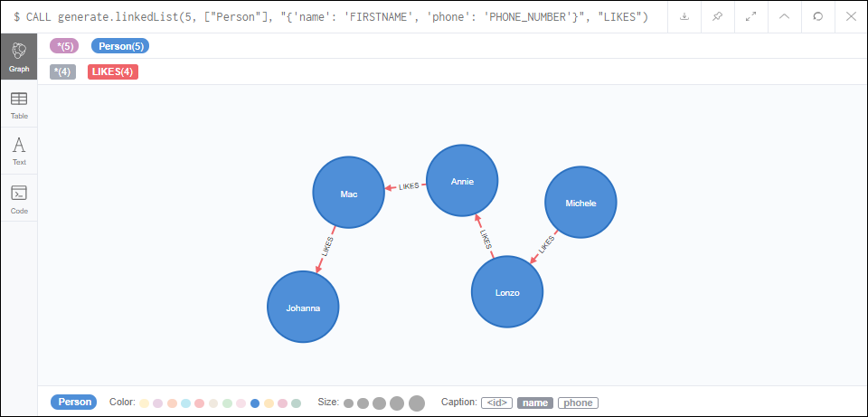
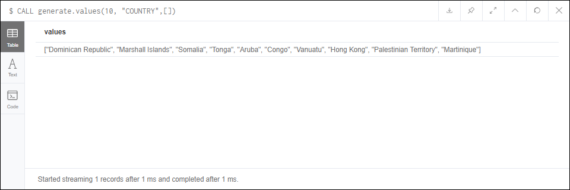
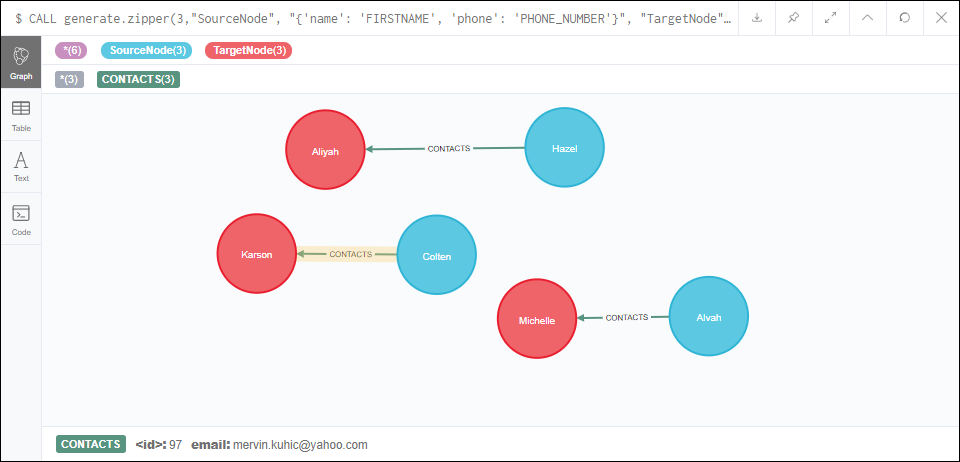
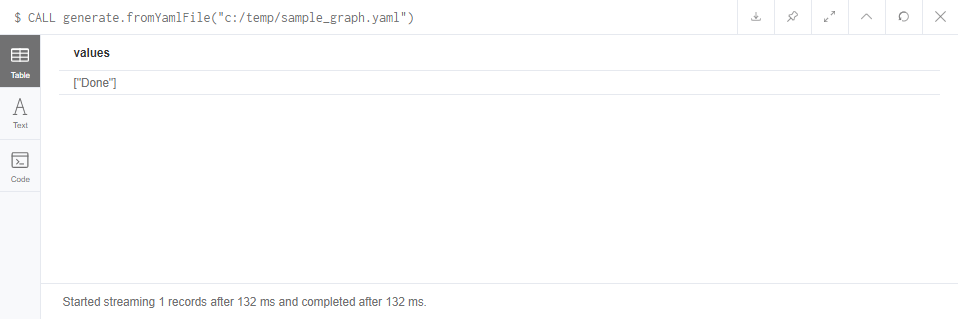

# <u>Neo-Goodies</u>

> Useful tools for working with Neo4J  
> Currently the library consists of function allowing:  
>* Creation of different graph structures
>* Working with the embedded Neo4J server (mainly for unit-testing)
---
```
CALL generate.nodes(5, ["Officer", "Gentleman"], "{'name': 'FIRSTNAME', 'phone': 'PHONE_NUMBER'}")
```

```
CALL generate.linkedList(5, ["Person"], "{'name': 'FIRSTNAME', 'phone': 'PHONE_NUMBER'}", "LIKES")
```

```
CALL generate.values(10, "COUNTRY",[])
```

```
CALL generate.zipper(3,"SourceNode", "{'name': 'FIRSTNAME', 'phone': 'PHONE_NUMBER'}", "TargetNode", "{'name': 'FIRSTNAME', 'country': 'COUNTRY'}", "CONTACTS", "{'email':'EMAIL_ADDRESS'}")
```

```
CALL generate.fromYamlFile("c:/temp/sample_graph.yaml")
```
Check out graph-template sample [here](graph_samples/sample_graph.yaml)  

